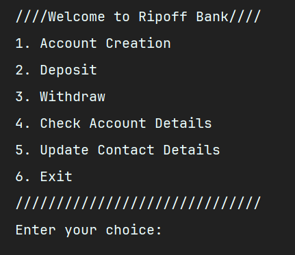

# Banking Application - Java Programming (Assignment 01)

## School of Engineering & Technology (SOET)  
**Session:** 2025-26  
**Programme:** B.Tech / BCA / BSc  
**Semester:** 3rd  

**Course Codes:** ENCS201, ENCA203, ENBC205  
**Course Name:** Java Programming  
**Faculty:** Dr. Manish Kumar  

---

## Assignment Details
- **Assignment No:** 01  
- **Project Title:** Banking Application for Account Management  
- **Submission Deadline:** 5th September 2025  
- **Weightage:** 10% Internal Evaluation  

---

## Problem Statement
Design and implement a banking application in Java that allows users to manage accounts by performing operations like:
- Create account
- Deposit money
- Withdraw money
- View account details
- Update contact details  

The application demonstrates use of **Java basics, control structures, arrays, strings, and OOP**.

---

## Objectives
- Apply Java fundamentals (data types, operators, control structures).  
- Use decision-making and looping.  
- Handle input/output with Scanner.  
- Work with single & multi-dimensional arrays.  
- Manipulate Strings with Java’s `String` class.  

---

## Features
- Account creation with unique account number.  
- Deposit/Withdraw with validation.  
- Display account details.  
- Update contact details (email & phone).  
- Menu-driven interface using arrays.  

---

## Evaluation Rubric
- ✅ Correct implementation of Account class  
- ✅ Functional menu operations  
- ✅ Use of control structures (loops, if-else, switch)  
- ✅ Efficient use of arrays  
- ✅ String handling and validation  
- ✅ Exception handling & input validation  
- ✅ Modular, readable, and documented code  

---

## Author
Submitted individually by **[Your Name]**  
Programme: **B.Tech/BCA/BSc (3rd Sem)**  

---

## Demo

